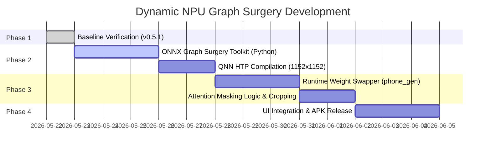

# Roadmap: Dynamic NPU Graph Surgery (Dynamic LoRA & Masked Resolutions)

## 1. Context and Motivation

In the development of on-device deep learning pipelines for Qualcomm Hexagon NPUs (QNN HTP), the standard industry practice has long been **static compilation**. Moving from early prototypes (v0.2.x) to v0.5.1, we initially built a **static resolution bucket system** paired with compile-time **LoRA weight baking (fusion)**. 

While static compilation achieves the absolute peak performance for a single, frozen model configuration by allowing the QNN compiler to perform deep hardware-specific layout tiling and weight quantization, it introduces several severe limitations:
1. **Massive Storage Footprint:** Every compiled LoRA-resolution combination requires a full 1.6 GB UNet binary. Storing three LoRAs across three resolutions eats up nearly 15 GB of mobile storage.
2. **Extreme Compile-Time Overhead:** Generating a new binary slot takes roughly 20 minutes on high-end host CPUs.
3. **Zero Runtime Flexibility:** Changing resolutions or swapping LoRA weights is impossible without tearing down the NPU context, reloading a different massive binary, and re-initializing the hardware pipelines—taking up to 30 seconds and risking Android LMK (Low Memory Killer) crashes due to RAM spikes.

This document outlines our transition to an advanced **ONNX Graph Surgery** architecture. By rewriting the UNet mathematical graph *prior* to compilation, we can expose dynamic inputs that allow **runtime LoRA swapping (in <20ms)** and **arbitrary resolutions (from 512x512 up to 1152x1152 / 1280x1280)** using a single, unified NPU binary shell.

---

## 2. Mathematical Architecture

### 2.1 Dynamic LoRA Swapping via Input Injection

A standard Low-Rank Adaptation (LoRA) layer mathematically updates a pre-trained weight matrix $W_0 \in \mathbb{R}^{d_{out} \times d_{in}}$ using two low-rank matrices $A \in \mathbb{R}^{r \times d_{in}}$ and $B \in \mathbb{R}^{d_{out} \times r}$ (where $r \ll \min(d_{in}, d_{out})$):

$$W_{fused} = W_0 + \alpha \cdot (B \cdot A)$$

In our dynamic NPU architecture, instead of fusing $W_{fused}$ statically, we modify the attention projection layers (`to_q`, `to_k`, `to_v`, `to_out.0`, `proj_in`, `proj_out`) inside the ONNX graph to implement a parallel execution branch:

$$Y = X \cdot W_0 + \alpha \cdot ((X \cdot A^T) \cdot B^T)$$

Where:
* $X \in \mathbb{R}^{B \times L \times d_{in}}$ is the activation tensor.
* $W_0$ is the frozen base model weight, quantized to INT8/FP16 and packed inside the NPU binary.
* $A^T$ and $B^T$ are declared as **dynamic graph inputs** (`lora_A` and `lora_B`).
* $\alpha$ is a dynamic scalar input.

```
       Activation Input X
         /           \
   [Base Linear]   [LoRA Down: X * lora_A]
        |            |
   (X * W_base)    [LoRA Up: * lora_B]
        |            |
        |          [Scale: * alpha]
         \           /
        [Elementwise Add]
                |
             Output Y
```

#### Hardware Compatibility & Padding:
Since QNN HTP compiles strict static execution dimensions, we define a maximum rank limit: **$r_{max} = 64$**.
* **Zero Padding:** For any runtime LoRA with rank $r < 64$ (e.g., $r = 8$), the host CPU reads the `.safetensors` weight dictionary, pads the matrices with zeros up to rank $64$, and feeds them directly into the QNN input buffers.
* **Zero-Bypass:** If no LoRA is active, we pass $\alpha = 0$ or zeroed matrices, nullifying the branch in a single execution cycle.

---

### 2.2 Arbitrary Resolutions via Masked Attention Padding

Qualcomm Hexagon Tensor Accelerators (HTA) allocate a dedicated, high-speed static vector memory block called **VTCM (Vector Tightly Coupled Memory)**. If input shapes vary dynamically, QNN either fails to compile or falls back to system DDR memory (slowing down execution by 100x).

To bypass this and achieve arbitrary resolutions ($W \times H$) on the fly:
1. **Maximum Shell Compilation:** We compile the UNet and VAE under a single, maximum square template shape, pushing the Hexagon Elite architecture to **`1152x1152`** (or `1280x1280`).
2. **Virtual Padding:** For any requested resolution below the maximum (e.g., `856x640`), the latents are padded with zeros up to the maximum compiled shape ($144 \times 144$ for `1152x1152`).
3. **Attention Masking Surgery:** We inject a dynamic `attention_mask` tensor into the Self-Attention and Cross-Attention blocks of the UNet.
4. **Softmax Isolation:** In the attention mechanism:
   $$\text{Attention}(Q, K, V) = \text{softmax}\left(\frac{Q K^T}{\sqrt{d_k}} + M\right) V$$
   We set the mask $M_{i, j} = -10000.0$ (instead of IEEE $-\infty$, which collapses the QNN quantization range and triggers `NaN` / Hexagon HVX kernel panics) for any token position $j$ residing in the padded boundary. During the softmax operation, these positions are mathematically zeroed out:
   $$e^{-10000.0} \approx 0$$
   This guarantees that active pixels never interact with or receive information from the padded boundaries, preserving absolute mathematical equivalence to a native generation run at the exact $W \times H$ size.
5. **Post-Processing Slice:** After passing through the VAE decoder, the active $W \times H$ region is cropped out and saved.

---

## 3. Memory & RAM Optimization for Android Flagships

Premium flagship devices (Snapdragon 8 Elite / Snapdragon X Elite) boast extremely fast NPUs (45–80 TOPS) but often suffer from severe RAM overhead: Android system overlays and background daemons can consume up to 12 GB of the 16 GB physical RAM, leaving only **~4 GB of free RAM** for applications.

To prevent the Android **Low Memory Killer (LMK)** from terminating our process:
1. **Aggressive Context Garbage Collection:** Python and JVM runtimes are manually cleared using explicit garbage collection (`gc.collect()`, `System.gc()`) immediately before and after loading QNN contexts.
2. **Buffer Recycling:** Instead of allocating new memory blocks for intermediate step outputs, we pre-allocate a fixed, reusable set of NPU input/output tensors.
3. **Pre-Warm and Unload Orchestration:** When the generation completes or the application goes into the background, the NPU memory is immediately freed, and the QNN backend is unloaded, returning a clean 2 GB of RAM back to the operating system.

---

## 4. Technical Roadmap & Implementation Steps



1. **Phase 1: Stable Release (`v0.5.1`):** Finish current bucket model compilation, build APK, and verify baseline speeds on-device.
2. **Phase 2: Graph Surgery Scripting:** Write `onnx_surgery_sdxl.py` to automate weight projection branches and attention mask injection.
3. **Phase 3: Runtime Swapping & Masking:** Update `phone_generate.py` on the device to handle safetensors loading, weight zero-padding to $r_{max} = 64$, dynamic attention mask computation, and final VAE output cropping.
4. **Phase 4: Data-Driven UI:** Modify the APK `MainActivity.java` to dynamically scan active NPU capacities, replacing the static spinner preset menu with a fully dynamic aspect-ratio slider ranging from `512x512` to `1152x1152`.
