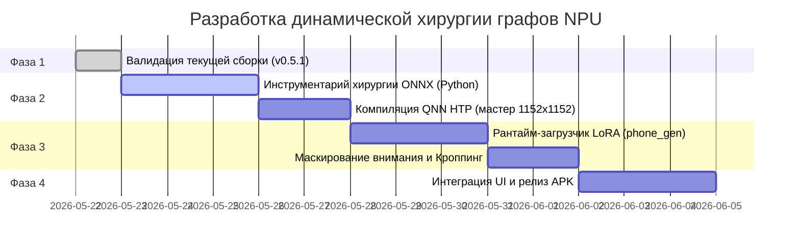

# Технический план: Динамическая хирургия графов NPU (Динамический рантайм LoRA и маскируемых разрешений)

## 1. Контекст и мотивация

В разработке пайплайнов глубокого обучения для Qualcomm Hexagon NPU (архитектура QNN HTP) стандартной практикой всегда была **статическая компиляция**. Переходя от ранних прототипов (v0.2.x) к версии v0.5.1, мы изначально спроектировали **систему статических бакетов разрешений** в сочетании со статической **«запечкой» (fusion) весов LoRA** на этапе сборки.

Хотя статическая компиляция обеспечивает абсолютный пик производительности для одной фиксированной конфигурации модели (поскольку компилятор QNN выполняет глубокую аппаратную оптимизацию раскладки тензоров и квантование весов под Hexagon), она накладывает ряд критических ограничений:
1. **Колоссальный объем дисковой памяти:** Каждая отдельная комбинация LoRA и разрешения требует компиляции файла UNet размером 1.6 ГБ. Хранение трех LoRA-моделей для трех разрешений съедает почти 15 ГБ памяти телефона.
2. **Огромные затраты времени на сборку:** Генерация нового бинарного слота занимает около 20 минут на мощном процессоре хоста.
3. **Отсутствие гибкости рантайма:** Изменение разрешения или смена LoRA-модели на лету невозможны без полной выгрузки контекста NPU, повторного считывания другого тяжелого бинарника и повторной инициализации аппаратных конвейеров. Это занимает до 30 секунд и несет риск мгновенного краша процесса системным LMK (Low Memory Killer) из-за всплесков RAM.

Этот документ описывает наш переход на передовую архитектуру **хирургии графов ONNX (ONNX Graph Surgery)**. Модифицируя математический граф UNet *перед* компиляцией, мы внедряем динамические входы, обеспечивающие **горячую смену LoRA (за <20 мс)** и **произвольные разрешения (от 512x512 до 1152x1152 / 1280x1280)** в рамках одного универсального бинарного шелла NPU.

---

## 2. Математическая архитектура рантайма

### 2.1 Динамическая загрузка LoRA через инъекцию входов графа

Математически классический слой низкоранговой адаптации (LoRA) обновляет веса предобученной матрицы $W_0 \in \mathbb{R}^{d_{out} \times d_{in}}$ с помощью двух матриц низкого ранга $A \in \mathbb{R}^{r \times d_{in}}$ и $B \in \mathbb{R}^{d_{out} \times r}$ (где $r \ll \min(d_{in}, d_{out})$):

$$W_{fused} = W_0 + \alpha \cdot (B \cdot A)$$

В нашей динамической архитектуре NPU вместо статического слияния весов мы перестраиваем ONNX-граф в слоях проекции внимания (`to_q`, `to_k`, `to_v`, `to_out.0`, `proj_in`, `proj_out`), создавая параллельную ветвь вычислений:

$$Y = X \cdot W_0 + \alpha \cdot ((X \cdot A^T) \cdot B^T)$$

Где:
* $X \in \mathbb{R}^{B \times L \times d_{in}}$ — тензор входящих активаций.
* $W_0$ — замороженные базовые веса модели, квантованные в FP16/INT8 и жестко запеченные в бинарный контекст NPU.
* $A^T$ и $B^T$ — объявляются как **динамические входы графа** (`lora_A` и `lora_B`).
* $\alpha$ — динамический скалярный входной коэффициент масштабирования LoRA.

```
       Входной тензор активаций X
         /                      \
   [Базовый линейный слой]    [LoRA Down: X * lora_A]
        |                               |
   (X * W_base)               [LoRA Up: * lora_B]
        |                               |
        |                      [Масштаб: * alpha]
         \                             /
        [Поэлементное сложение (Add)]
                      |
                  Выход Y
```

#### Аппаратная совместимость и паддинг весов:
Поскольку QNN HTP требует строго фиксированных размеров портов ввода-вывода, мы фиксируем максимальный поддерживаемый ранг LoRA: **$r_{max} = 64$**.
* **Паддинг нулями:** При загрузке LoRA с меньшим рангом $r < 64$ (например, $r = 8$) хост-процессор на лету считывает оригинальный `.safetensors`, дополняет матрицы нулями до ранга $64$ и напрямую копирует их в буфер входа NPU.
* **Режим без LoRA:** Если LoRA не используется, мы передаем $\alpha = 0$ или матрицы, заполненные нулями, что полностью нивелирует вклад ветви LoRA за один такт вычислений.

---

### 2.2 Произвольные разрешения через маскирование внимания

Аппаратные ускорители Hexagon Tensor Accelerator (HTA) выделяют строго фиксированный сегмент сверхбыстрой векторной памяти **VTCM (Vector Tightly Coupled Memory)** для выполнения операций. При динамическом изменении размеров тензоров QNN либо выдает ошибку сборки, либо переводит вычисления на медленную системную DDR-память (замедляя генерацию в 100 раз).

Для обхода этого ограничения и реализации любых разрешений ($W \times H$) "на лету":
1. **Сборка мастер-шаблона:** Мы компилируем UNet и VAE под единое максимальное квадратное разрешение, выжимая максимум из Hexagon Elite — **`1152x1152`** (или `1280x1280`).
2. **Виртуальный паддинг (Virtual Padding):** При запросе меньшего разрешения (например, $856 \times 640$) входные латенты дополняются нулями до мастер-размера ($144 \times 144$ латентных токенов для `1152x1152`).
3. **Внедрение маски внимания:** Мы модифицируем ONNX-граф блоков Self-Attention и Cross-Attention, добавляя динамический входной тензор `attention_mask`.
4. **Математическая изоляция Softmax:** В механизме внимания:
   $$\text{Attention}(Q, K, V) = \text{softmax}\left(\frac{Q K^T}{\sqrt{d_k}} + M\right) V$$
   Мы заполняем маску $M_{i, j} = -10000.0$ (вместо IEEE $-\infty$, который выжигает квантователь QNN и приводит к `NaN` / панике ядра Hexagon HVX) для всех токенов $j$, находящихся в пустой зоне паддинга. Операция softmax математически зануляет влияние этих токенов:
   $$e^{-10000.0} \approx 0$$
   Это полностью исключает перенос информации или размытие границ между активным сгенерированным изображением и пустыми полями паддинга без разрыва диапазона квантования. Результат математически идентичен честной генерации на родном разрешении $W \times H$.
5. **Финальный кроп:** После прохождения VAE-декодера изображение обрезается до исходного размера $W \times H$ и отдается пользователю.

---

## 3. Оптимизация оперативной памяти для Android-флагманов

Флагманские устройства на чипах Snapdragon 8 Elite и Snapdragon X Elite обладают мощнейшими NPU, но часто сталкиваются с сильным дефицитом свободной оперативной памяти: системная оболочка Android и фоновые ИИ-службы могут занимать до 12 ГБ из физических 16 ГБ RAM, оставляя для приложений **всего около 4 ГБ свободной памяти**.

Для предотвращения принудительного закрытия приложения Android-механизмом **Low Memory Killer (LMK)** мы внедряем комплекс мер:
1. **Агрессивный сбор мусора рантайма:** Среды выполнения Python и JVM принудительно вызывают очистку памяти (`gc.collect()`, `System.gc()`) непосредственно перед загрузкой и сразу после инициализации контекстов QNN.
2. **Рециклинг буферов (Buffer Reuse):** Вместо динамического выделения памяти под промежуточные результаты шагов генерации, мы заранее аллоцируем фиксированный набор переиспользуемых тензоров ввода-вывода NPU.
3. **Оркестрация Pre-Warm и Unload:** Сразу после завершения генерации или при сворачивании приложения в фон ресурсы NPU освобождаются, а бэкенд QNN полностью выгружается из памяти, мгновенно возвращая системе до 2 ГБ чистой оперативной памяти.

---

## 4. Этапы технической реализации



1. **Фаза 1: Стабильный релиз (`v0.5.1`):** Завершение компиляции текущих бакетов моделей, сборка debug APK и верификация базовой скорости на устройстве.
2. **Фаза 2: Скрипты хирургии графов:** Разработка `onnx_surgery_sdxl.py` для автоматического создания параллельных LoRA-ветвей и портов маски внимания в ONNX.
3. **Фаза 3: Динамический рантайм:** Обновление `phone_generate.py` на устройстве для считывания safetensors, паддинга весов до ранга $64$, вычисления динамической маски и обрезки финального кадра VAE.
4. **Фаза 4: Динамический UI:** Модификация `MainActivity.java` в Android-проекте для опроса доступных на лету разрешений NPU. Статический выбор пресетов заменяется на динамический слайдер соотношений сторон в диапазоне от `512` до `1152` пикселей.
